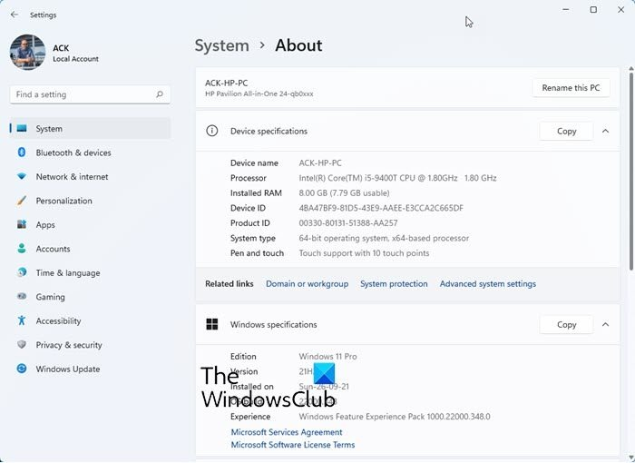
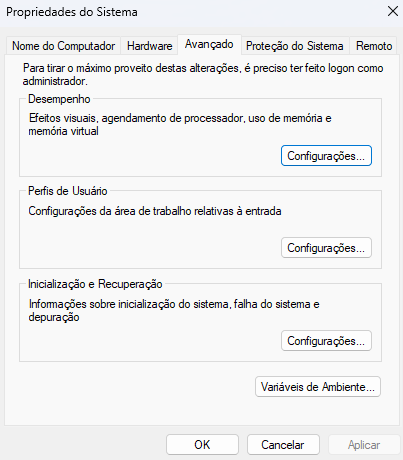
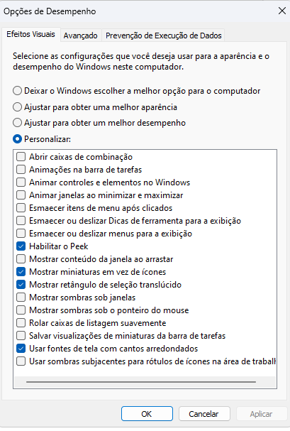

# ⚙️ Windows Optimization Guide

This guide will help you optimize your Windows operating system for better performance, focusing on system configurations that enhance fluidity and responsiveness.

## 🛠️ Steps to Optimize Windows

### 1. **Access System Properties**

1. Open the **Start Menu** and type `System`.
2. Click on **System** to open the System Information window.
   
    *(optional image placeholder)*

### 2. **Open Advanced System Settings**

1. In the **System** window, look to the right and click on **Advanced System Settings**.

    *(optional image placeholder)*

2. The **System Properties** window will appear. Make sure you are in the **Advanced** tab.

### 3. **Optimize Performance Settings**

1. Under the **Performance** section, click the **Settings...** button.

2. In the **Performance Options** window, select the **Custom** option and uncheck unnecessary visual effects. To replicate the optimal settings shown in the image below, adjust the options as follows:

   

3. Click **Apply** and then **OK** to save the changes.

### 4. **Restart Your Computer**

After applying these settings, restart your computer to ensure the changes take full effect.

---

## 🎯 Benefits of This Optimization

- **Faster System Performance**: Disabling unnecessary visual effects can reduce CPU and memory load.
- **Enhanced Responsiveness**: These settings prioritize performance over appearance, making your system more responsive.

## 📂 File Information

- `painel-avancado-configs.png`: This image demonstrates the recommended settings for optimizing the system.

---

Following these steps will help make your Windows system more fluid, improving overall performance without compromising essential functionality.
